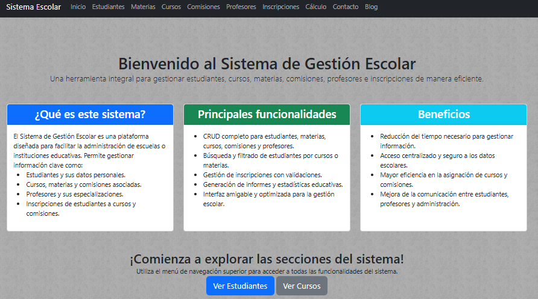

<p align="center">
  
  
</p>

# Sistema de Gestión Escolar

## Integrantes del Grupo
- **Mansilla Agustin**
- **Prieto Ignacio**
- **Ríos Gómez Pedro**
- **Zozaya Mateo**
- **Cleva Joaquín**

## Descripción del Proyecto


El **Sistema de Gestión Escolar** es una aplicación web desarrollada en Laravel que tiene como objetivo facilitar la administración de estudiantes, cursos, materias, comisiones y profesores en un entorno escolar.  
Esta herramienta permite realizar operaciones de CRUD (Crear, Leer, Actualizar, Eliminar) para cada entidad del sistema, junto con la generación de reportes, vistas intuitivas y opciones avanzadas de filtrado y búsqueda. Utiliza **Bootstrap** para lograr un diseño amigable y responsivo.

### Funcionalidades Principales
- **Gestión de Estudiantes:** Registro, edición, eliminación y búsqueda de estudiantes con filtros por nombre y curso.  
- **Gestión de Cursos y Materias:** Administración de cursos relacionados con materias específicas.  
- **Gestión de Comisiones:** Asignación de aulas y horarios para los cursos.  
- **Gestión de Profesores:** Asignación de profesores a comisiones.  
- **Reportes:** Generación de reportes de inscripciones, cursos por materias y asistencia de profesores, con opciones para exportar a PDF y Excel.  
- **Búsqueda Avanzada:** Filtros personalizados para cada entidad clave.  

---

## Pasos para Configurar el Proyecto

1. Clona el repositorio y modifica el archivo `.env` para configurar la base de datos:
   ```env
   DB_CONNECTION=mysql
   DB_HOST=127.0.0.1
   DB_PORT=3306
   DB_DATABASE=laravel
   DB_USERNAME=root
   DB_PASSWORD=
2. Instala las dependencias de PHP ejecutando:
   ```bash
   composer install
3. Generar clave de la aplicación:
   ```bash
   php artisan key:generate
4. Realiza las migraciones de la base de datos y siembra los datos iniciales:
   ```bash
   php artisan migrate:fresh --seed
5. Inicia el servidor de desarrollo:
   ```bash
    php artisan serve
##
¡Disfruta del desarrollo y gestión de tu proyecto escolar con Laravel y Bootstrap!